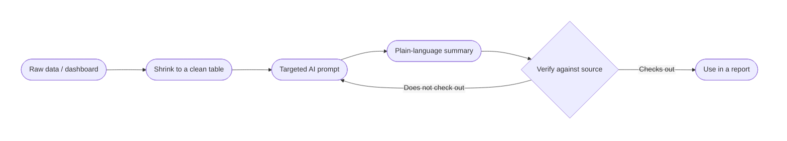

# AI for Everyday Work: Analytics & Decision-Making

## What You Will Learn in This Lesson

In earlier sessions you learned what AI and large language models are, how to prompt one clearly, and how to take an idea from a rough sketch to a tested prototype. This lesson adds a skill every team eventually needs: turning a pile of numbers into a decision, using an AI chat tool as your analysis partner — not your analyst.

You do not need to know statistics, SQL, or a specialist analytics tool. Everything in this lesson works with a normal AI chat tool (ChatGPT or an equivalent) and data you can paste as a table or upload as a file. By the end, you will be able to turn a raw dataset into a plain-language summary, ask targeted questions that surface real trends, catch the AI when it is wrong, and package verified findings into a short, decision-ready report.

### A Real-Life Story — Why This Lesson Matters

Meera is two weeks into a summer internship at a fintech startup. Her manager drops a spreadsheet of app activity into her inbox: "Can you tell me what's happening with onboarding and send me a summary by lunch?"

Meera pastes the whole sheet into a chatbot and types `summarize this`. The reply is confident and fluent: three bullet points, a headline number, and a line claiming "conversion has been steadily improving all quarter." She forwards it as-is.

At the 2 p.m. review, her manager asks, "Improving compared to what baseline? I don't see that in the raw numbers." Meera cannot answer — she never checked. The claim was invented gloss on real data, not a real trend.

Down the hall, Arjun — a second-year intern — got the same kind of spreadsheet the week before. He also used AI, but he pasted a clean, labelled table (not a wall of raw rows), asked for specific things ("overall conversion rate, the single biggest drop-off step, and any single day that looks unusual"), and then checked every number the AI gave him against the source table before sending anything to his manager. He caught one place where the AI had rounded a percentage the wrong way — and fixed it before anyone else saw it.

Same tool, same kind of data. Different outcome, because of *how* the tool was used. This lesson is about building Arjun's habits: structure what you feed the AI, ask sharp questions, and verify before you ship a conclusion.

### The Running Example for This Lesson

Across all three scenes you will work with one running case: **Groww**, an Indian stock-investing and wealth-management app. The data is a **synthetic dataset built to resemble a real fintech product** — 1,000 simulated users and roughly 23,500 app events between 1 April and 15 July 2026. It is **not real Groww user data**; it exists purely so you have one consistent, realistic dataset to practise on across the whole session.

The dataset tracks two journeys that most product and growth teams care about:

- **Onboarding** — the steps a new user must clear before they can invest: `Sign Up Started → Mobile Number Verified → PAN Details Entered → KYC Document Uploaded → KYC Approved → Bank Account Linked → First Deposit Completed`. This is a **regulated** flow — part of the drop-off is a backend compliance process (KYC review), not something a product team can simply redesign away.
- **Investing** — what a user does once they start exploring: browsing a stock or mutual fund, watchlisting it, placing an order, and (for some) setting up a recurring **SIP** (Systematic Investment Plan) — the strongest sign of a user who is going to stick around.

Every table you will paste into an AI tool in this lesson (in the `resources/` folder alongside these notes) is a **real, pre-checked summary** of that dataset. That matters: you will always have a correct answer to check the AI against, which is the whole point of Scene 3.

---

## Scene 1: Data Summarization & Plain-Language Insights

In this scene you will learn how to hand a dataset to an AI tool and get a trustworthy plain-language summary back — one that captures the real headline, not just a confident-sounding paragraph.

### What Is AI-Assisted Data Summarization?

- **Official Definition:** AI-assisted data summarization is the use of a generative AI tool to convert structured data (a table, export, or dashboard) into a short, plain-language description of what the data shows.
- **In Simple Words:** Instead of staring at rows and columns yourself, you hand the AI a clean table and ask it to tell you, in a few sentences, what is going on.
- **Real-Life Example:** You paste a week's worth of app-store review ratings into a chat tool and ask, "Summarize the overall trend and call out anything unusual" — instead of scrolling through every review yourself.

This is useful, but it is **not** the same as the AI actually understanding your business. It is generating the kind of summary that is *typical* for data shaped like yours — the same next-token prediction you learned about earlier, applied to numbers instead of prose. That is exactly why Scene 3 exists: to check its work.

### Getting Data Into an AI Tool

There are two practical ways to give an AI chat tool structured data in a live session:

| Method | How it works | Best for |
|--------|---------------|----------|
| **Paste as text** | Copy a small table (CSV or a few rows) directly into the chat box, usually inside a code block so formatting survives | Small, already-aggregated tables — the method used throughout this lesson |
| **Upload a file** | Use the tool's attach/upload button to hand over a `.csv` or `.xlsx` file directly | Larger raw exports, when your AI tool supports file analysis |

For this lesson, every exercise uses the **paste** method with small, pre-aggregated tables from the `resources/` folder — nobody should be dropping 23,000 raw rows into a chat window and hoping for the best. A good analyst **shrinks the data to the question** before asking the AI anything. That shrinking step (grouping, counting, averaging) is itself part of the skill — whether you do it in a spreadsheet first or ask the AI to do it from an upload, the summary is only as good as the table behind it.



### Reading a Dashboard, Not Just a Raw Table

A "dashboard" is simply a set of pre-computed numbers laid out for scanning — the same idea as a table, dressed up visually. Whether you are looking at a chart on a screen or a small CSV like the ones in this lesson, the skill is the same: read the **headline metric**, note the **breakdown underneath it**, and only then ask the AI to explain what it means.

| Dashboard element | What it usually shows | Groww example |
|---------------------|--------------------------|-----------------|
| Headline tile | One big number for the whole period | 1,000 signups, 479 first deposits |
| Breakdown/segment view | The same metric split by a category | Conversion split by acquisition channel |
| Time series / trend line | How the metric moved over days or weeks | Daily signups, 1 April – 15 July |

When you paste a dashboard-style table into an AI tool, name each element explicitly in your prompt (*"the headline tile shows X, the breakdown by channel shows Y"*) rather than assuming the AI will label the rows the same way you would. A dashboard exported as a table loses its visual cues — colour, size, position — so the words in your prompt have to carry that meaning instead.

**Example prompt (Role–Context–Format), using `resources/onboarding-funnel-summary.csv`:**

```
Role: You are a product analyst helping a non-technical founder understand onboarding performance.
Context: Below is the Groww onboarding funnel — the % of users who moved from Sign Up Started
through First Deposit Completed. [paste the CSV table here]
Format: Give me a 3-4 sentence plain-language executive summary. Include the overall
conversion rate (Sign Up Started to First Deposit Completed) and the single step with the
biggest drop-off. Do not invent numbers that are not in the table.
```

A well-formed reply should sound roughly like this: *"Out of 1,000 users who started sign-up, 479 completed their first deposit — an overall conversion rate of 47.9%. The steepest single drop happens between PAN Details Entered and KYC Document Uploaded, where conversion falls to 85.1%, a loss of about 15 points. Every other step holds above 85% conversion, so this one step deserves the closest look."*

Notice what that reply does **not** do: it does not add a cause ("users are giving up because the form is confusing") that was never in the data, and it does not invent a trend line the table never showed. Watch for both mistakes — they are the most common way an AI summary quietly goes wrong.

### What a Strong Summary Must Include

- **Official Definition:** A complete data summary reports **overall performance** (the headline number), **macro patterns** (is it flat, rising, falling, cyclical), and **anomalies** (any point that breaks the pattern and deserves a second look).
- **In Simple Words:** Don't just give one number. Say what the big picture looks like, and flag anything strange.
- **Real-Life Example:** A weather summary that only says "28°C" is useless without "and it's been rising all week, except for one sudden dip on Tuesday."

| Summary element | What to ask the AI for | Groww example |
|------------------|--------------------------|-----------------|
| Overall performance | The headline metric | 47.9% overall onboarding conversion (1,000 → 479 users) |
| Macro pattern | Is the trend flat, growing, declining, seasonal? | Weekly signups hover around 65–90 per week with no strong upward or downward trend |
| Anomalous data points | Any single point that stands out from the rest | 8 June has 21 signups against a ~90-day average of about 11 — worth a second look |

**Activity: Spot the Anomaly**

Open `resources/daily-signups.csv` (90 days of daily sign-up counts) and paste it into an AI tool with this prompt: *"Here is 90 days of daily sign-ups. Tell me the average, and flag any day that looks like a real outlier rather than normal day-to-day noise."*

*(Check: the average is about 11 signups/day, with a typical day landing between 8 and 13. 8 June (21) and 10 June (19) sit well above that band. A single day near the average — say, 12 or 13 — is normal noise, not a headline. If the AI calls a 12-signup day an "alarming spike," that is a sign it is manufacturing drama rather than reading the distribution — push back and ask it to compare against the full range, not just yesterday.)*

### Evaluating AI Summary Accuracy

- **Official Definition:** Evaluating summary accuracy means checking every claim in the AI's plain-language output against the source data it was given, so the takeaway is not distorted by rounding, invented causes, or cherry-picked numbers.
- **In Simple Words:** Before you forward an AI's summary to anyone, hold it up against the table it came from and check that every sentence actually matches.
- **Real-Life Example:** A caption under a chart says "sales doubled this month." You check the chart — it went from 40 to 60, not 40 to 80. The caption is wrong even though it sounds plausible.

**Activity: Catch the Distorted Summary**

An AI tool was given `resources/onboarding-conversion-by-channel.csv` and asked to summarize channel performance. It replied:

> "Referral is clearly the best channel, converting nearly all signups, while Facebook/Instagram Ads is barely worth running with only about 13% conversion. Since Facebook/Instagram Ads is failing, the team should cut that budget entirely."

Check this against the table (Referral 93.0% on 143 signups; Facebook/Instagram Ads 13.2% on 190 signups). On paper, mark:

- Which parts are **accurate**, which are **overstated**, and which go **beyond what the data can support**?
- Is "cut that budget entirely" a conclusion the funnel table alone can justify?

*(Check: the two percentages themselves are accurate. "Nearly all" for 93.0% is a fair plain-language rounding. But "the team should cut that budget entirely" is not supported by this table — it says nothing about cost per signup or how those users behave *after* signing up. A conversion table can tell you which channel converts best; it cannot, by itself, tell you which channel is worth funding. That distinction — what the data can prove versus what sounds like a natural next sentence — is exactly what Scene 3 will drill into.)*

---

## Scene 2: Trend Extraction & Targeted Querying

In this scene you move from "summarize this" to asking sharp, specific questions that pull out trends, comparisons, and outliers a generic summary would miss.

### Why Targeted Queries Beat "Analyze This"

- **Official Definition:** A targeted analytical query is a specific, scoped question aimed at one comparison or pattern, rather than an open-ended request for "insights."
- **In Simple Words:** "Analyze this data" gets you a vague essay. "Which of these six channels has the widest gap between best and worst, and by how much?" gets you a number you can act on.
- **Real-Life Example:** Asking a shopkeeper "how's business?" gets small talk. Asking "which product sold the least last week?" gets a stock decision.

| Vague prompt | Targeted prompt |
|---------------|-------------------|
| "What do you see in this data?" | "Rank these six channels by conversion rate and tell me the size of the gap between the highest and lowest." |
| "Any trends here?" | "Looking at weekly sign-ups by channel, which channel grew the fastest between week 1 and week 13, and which one shrank?" |
| "Tell me about drop-off." | "Which single step in this funnel has the largest percentage-point drop from the step before it?" |

### Prompt Chains and Guided Exploratory Analysis

- **Official Definition:** A prompt chain is a sequence of connected prompts, where each question builds on the AI's previous answer, mirroring how a human analyst explores data one question at a time (a lightweight version of **exploratory data analysis**, or **EDA**).
- **In Simple Words:** Instead of asking one giant question, ask a first question, read the answer, then ask the next question it naturally leads to.
- **Real-Life Example:** You don't ask a doctor "what's wrong with me" in one sentence and stop — the doctor asks a question, listens, then asks a sharper follow-up based on what you said.

**Example prompt chain, using `resources/onboarding-conversion-by-channel.csv`:**

1. *"Rank these six acquisition channels by overall conversion rate, highest to lowest."*
2. *(after the AI replies)* *"What is the size of the gap between the best and worst channel, in percentage points?"*
3. *"Now look at `resources/conversion-by-other-segments.csv`. Compare the spread you see across platform, city tier, and user type against the spread across acquisition channel. Which variable is worth investigating further, and which ones look flat?"*

Each step narrows the question using what the previous answer revealed — that is prompt chaining in practice, and it is how you turn "explore this data" into a specific, defensible finding.

**Answer key for this chain:** Acquisition channel produces a roughly 80-point spread — Referral at 93.0% down to Facebook/Instagram Ads at 13.2%. Platform (43.5%–51.3%), city tier (42.3%–49.4%), and user type (45.0%–57.0%) are all far narrower. Acquisition channel is the variable worth investigating further; the other three are close to flat and do not deserve the same attention.

### Guiding AI Through a Mini Exploratory Analysis

- **Official Definition:** Exploratory data analysis (EDA) is the general practice of examining a dataset from several angles — trends over time, comparisons between groups, relationships between two variables — before drawing a conclusion, rather than jumping straight to one number.
- **In Simple Words:** Look at the data from more than one direction before you decide what it's telling you.
- **Real-Life Example:** A teacher doesn't grade a class on one test alone — they look at the trend across several tests, and compare sections, before deciding a class is struggling.

A simple three-question EDA pattern works well with an AI chat tool, using `resources/weekly-signups-by-channel.csv`:

1. **Trend over time:** *"Looking at total weekly signups across all 13 weeks, is the overall trend flat, rising, or falling?"*
2. **Compare across groups:** *"Now break that down by channel — which channel's weekly signups grew the most from the first few weeks to the last few weeks, and which shrank?"*
3. **Ask a follow-up the answer suggests:** *"You said Organic Search looks fairly steady — is any single week for Organic Search unusually high or low compared to its other weeks?"*

Each question is answerable from the same small table, and each one is sharper than the last because it reacts to what the AI just said — that back-and-forth, not a single mega-prompt, is what "guiding AI through EDA" looks like in practice.

### Filtering Noise From Business-Critical Trends

- **Official Definition:** Filtering statistical noise means recognising when a variation is small enough, or based on too few data points, that it does not represent a real, actionable pattern.
- **In Simple Words:** Not every wiggle in the data means something. Some differences are just what randomness looks like in a small sample.
- **Real-Life Example:** One customer complains about slow delivery. That's an anecdote. A hundred customers complaining in the same week is a trend.

| Warning sign | Why it matters | Groww example |
|----------------|-----------------|-----------------|
| Small sample size | A percentage built on very few users can swing wildly by chance | Affiliate has only 44 signups — its 18.2% conversion rate is far less reliable than Organic Search's 59.9% built on 299 signups |
| Flat spread across a segment | If every group scores within a few points of each other, the variable probably is not the driver | Platform (Android/iOS/Web) spans only 43.5%–51.3% — not worth a headline |
| One-off single day | A single unusual day is not a trend on its own | The 8 June spike in signups is one day out of ninety — check for a repeat before treating it as a pattern |

**Activity: Which Finding Would You Act On?**

An AI tool, given both `resources/onboarding-conversion-by-channel.csv` and `resources/conversion-by-other-segments.csv`, produces two claims:

- **Claim A:** "Acquisition channel shows an ~80-point conversion spread (93.0% Referral vs. 13.2% Facebook/Instagram Ads) across large enough groups (44–299 signups per channel) to be a real difference worth investigating."
- **Claim B:** "Web users convert worse than iOS users (43.5% vs. 51.3%), so the team should deprioritize the Web app."

Which claim deserves a follow-up meeting, and which should be set aside for now? *(Check: Claim A is the one worth chasing — a wide, consistent spread across reasonably sized groups. Claim B rests on a gap of under 8 points and, per `resources/conversion-by-other-segments.csv`, Web has only 46 signups — too thin and too narrow a gap to justify redesigning a platform. Set B aside unless a much larger sample later shows the same pattern.)*

---

## Scene 3: Human Verification & AI-Assisted Report Creation

In this scene you learn to treat every AI-generated number and claim as a draft — checked before it goes anywhere near a decision — and then package the verified findings into a short report.

### Where AI Data Analysis Breaks Down

- **Official Definition:** In data analysis, **hallucination** is when an AI states a number, trend, or causal relationship that is not actually supported by the data it was given — often by silently rounding wrong, averaging incorrectly, or inferring a cause it never saw.
- **In Simple Words:** The AI can sound just as confident about a made-up statistic as about a real one. Fluent is not the same as correct.
- **Real-Life Example:** An AI is asked for the average of `48.2` and `48.9` and confidently replies `50.1`. It reads perfectly reasonable — and it's simply wrong.

A second, subtler failure mode is **mistaking correlation for causation** — claiming that because two things happened together, one caused the other.

**Case in point — a hypothesis that did *not* hold up:** A product team hypothesized that *"investing quickly (within 7 days of signing up) causes better long-term retention."* Testing it on `resources/activation-hypothesis-retention.csv` tells a different story:

| Cohort | Week 4 | Week 8 | Week 12 |
|--------|--------|--------|---------|
| Invested within 7 days of signup (n=64) | 84.4% | 46.9% | 15.6% |
| Invested after day 7 (n=166) | 78.3% | 45.2% | 18.1% |

The two curves are nearly identical. Speed-to-first-trade does **not** meaningfully predict retention — a genuinely useful finding, because it tells the team not to over-invest in rushing a user's first trade. Compare that to the same file's second comparison:

| Cohort | Week 4 | Week 8 | Week 12 |
|--------|--------|--------|---------|
| SIP starters (n=59) | 93.2% | 62.7% | 23.7% |
| Investors without a SIP (n=171) | 75.4% | 39.8% | 15.2% |

SIP starters retain roughly **1.5× better at Week 8** (62.7% vs. 39.8%) — a real, decision-worthy gap. Even here, be careful with the sentence you write next: "SIP starters retain better" is well supported; "setting up a SIP *causes* users to stay" is not proven by this table alone — users who were already more committed may simply be more likely to both start a SIP *and* stick around. The honest way to word a recommendation is *"test whether prompting more users toward a SIP increases retention"* — not *"SIPs cause retention."*

### Running Sanity Checks Before You Trust a Number

- **Official Definition:** A sanity check is a quick, deliberate verification of an AI's output — re-checking arithmetic, confirming the sample size behind a percentage, and testing whether a claim matches how the business actually works (domain logic) — before that output is used anywhere.
- **In Simple Words:** Three quick questions before you trust any AI-generated number: *Does the maths check out? Is the sample big enough to mean something? Does this match how the real world actually works?*
- **Real-Life Example:** An AI claims a shop's sales "tripled overnight." You check: it went from 3 sales to 9. Technically tripled — but the sample is so small that one lucky day explains it, not a real shift.

| Sanity check | What to do | Groww example |
|----------------|-------------|-----------------|
| **Verify calculations** | Recompute the headline number by hand from the raw table | 479 ÷ 1,000 = 47.9% — recompute it yourself rather than trusting the AI's stated percentage |
| **Check sample sizes** | Look at the *n* behind every percentage before comparing it to another | KYC Rejected is only 25 users — real, but too small to break down further by channel with any confidence |
| **Validate domain logic** | Ask whether the explanation makes sense given how the process actually works | KYC Approved takes ~48 hours on average — that is a backend compliance review, not a UX bug a redesign can fix |

**Activity: Catch the Arithmetic Error**

An AI, given `resources/kyc-timing-and-rejection.csv`, is asked for the KYC rejection rate as a percentage of users who uploaded documents. It replies: *"675 users uploaded KYC documents and 25 were rejected, so the rejection rate is about 25%."*

Check it yourself: 25 ÷ 675 = ?

*(Check: 25 ÷ 675 ≈ **3.7%**, not 25%. The AI appears to have used 25 as a percentage directly instead of dividing it by 675 — a common, easy-to-miss slip. Always recompute a ratio yourself before repeating it in a report; a single misplaced decimal changes "a minor edge case" into "a quarter of everyone is being rejected," which would send a team chasing the wrong fire.)*

### From Verified Findings to a Decision-Ready Report

- **Official Definition:** A decision-ready report (or executive brief) is a short document that states the headline finding, the evidence behind it, a specific and testable recommendation, and how the outcome will be checked — built only from claims that have already passed sanity checks.
- **In Simple Words:** Once you trust your numbers, package them into something a busy manager can act on in under two minutes — not a data dump.
- **Real-Life Example:** A doctor doesn't hand you a raw lab printout. They tell you what's wrong, what to do about it, and when to come back for a check-up.

**The Insight Memo Template**

| Section | What goes here |
|---------|------------------|
| Headline | One sentence: the single most decision-relevant, already-verified finding |
| Data finding | Which step/segment shows the biggest gap, with the specific verified numbers cited |
| Root cause read | Is it something the team can change directly, or a process/backend constraint? |
| Recommendation | One specific, testable change — not "improve retention," but something a team could build or run next sprint |
| Proposed check | How you would confirm the recommendation actually worked (e.g., a before/after comparison, and which metric proves it) |

**Example prompt to draft the memo, once every number is verified:**

```
Role: You are a product analyst writing a one-page memo for a founder review.
Context: Verified findings — overall onboarding conversion is 47.9% (1,000 to 479 users);
the biggest single-step drop is PAN Details Entered to KYC Document Uploaded (85.1%);
KYC Approved takes ~48 hours on average, a backend process, not a UX issue; SIP starters
retain 62.7% at Week 8 versus 39.8% for investors without a SIP; Facebook/Instagram Ads
has both the lowest onboarding conversion (13.2%) and the lowest Week 8 retention (5.8%)
of any channel.
Format: Fill the Insight Memo Template (Headline, Data finding, Root cause read,
Recommendation, Proposed check). Keep every section to 2-3 sentences. Do not add any
number that was not given to you above.
```

**Example completed memo** (built only from the verified numbers above):

> **Headline:** SIP adoption — not speed to a first trade — is the strongest retention lever in this data, and Facebook/Instagram Ads is bringing in the lowest-retaining users of any channel.
> **Data finding:** The onboarding funnel's biggest drop is PAN Details Entered → KYC Document Uploaded (85.1%). SIP starters retain 62.7% at Week 8 versus 39.8% for investors without a SIP.
> **Root cause read:** The KYC step itself is not the delay — KYC Approved takes ~48 hours on average, which is a backend compliance review, not something a UI change fixes directly.
> **Recommendation:** Prompt every user who completes a first trade with a one-tap SIP setup flow within 48 hours of that trade.
> **Proposed check:** Compare SIP Started rate among first-time investors before and after the prompt is introduced, tracked weekly for four weeks.

Notice every sentence in that memo traces back to a number given in the prompt — nothing was invented, and the "root cause read" line is explicit about which finding is a process constraint versus something the product team can act on directly.

**Mini checklist — before you send an AI-assisted report to anyone**

1. **Recompute:** Did I redo the key percentage myself, by hand, at least once?
2. **Sample size:** Is every comparison built on a big-enough group to trust?
3. **Cause vs. correlation:** Have I written "X is associated with Y," not "X causes Y," unless I have real evidence of causation?
4. **Traceability:** Can I point to the exact row or number behind every sentence in the report?
5. **Testability:** Does the recommendation say what to build or run next — not just "improve X"?

---

## Key Takeaways

- Treat an AI chat tool as a **fast first-draft partner** for data work, not a finished analyst. It generates the kind of summary that is typical for data shaped like yours — it does not verify itself.
- A strong summary reports **overall performance**, the **macro pattern**, and any **anomalies** — and every sentence in it should be checkable against the source table.
- **Targeted, chained prompts** ("rank these six," "what's the gap," "now compare that to...") surface real findings far better than "analyze this data."
- Before trusting a comparison, check whether it is built on a **big enough sample** and whether the spread is wide enough to matter — a flat breakdown or a tiny group is a valid, useful finding, not a failure to find a story.
- **Recompute the key numbers yourself.** Hallucinated arithmetic and invented causal claims are the two most common — and most dangerous — ways an AI-assisted analysis goes wrong.
- Correlation is not causation: "SIP starters retain better" is a fact you can cite; "SIPs cause retention" is a claim you would still need to test.
- A decision-ready report states a **headline**, the **verified evidence**, a **specific testable recommendation**, and **how you'll check it worked** — nothing more, nothing invented.

---

## Important Commands, Libraries & Terminologies

| Term | What It Means |
|------|----------------|
| **AI-assisted data summarization** | Using a generative AI tool to turn structured data into a plain-language description of what it shows |
| **Executive summary** | A short, plain-language summary written for someone who will not read the raw data themselves |
| **Macro pattern** | The overall shape of the data over time — flat, rising, falling, cyclical |
| **Anomaly / outlier** | A single data point that breaks the general pattern and deserves a closer look |
| **Targeted analytical query** | A specific, scoped question aimed at one comparison, instead of an open-ended request for "insights" |
| **Prompt chain** | A sequence of connected prompts, each one built on the answer to the previous prompt |
| **Exploratory data analysis (EDA)** | The practice of asking a series of guided questions to understand a dataset, one step at a time |
| **Statistical noise** | Variation in data that is small enough, or based on too few data points, to not represent a real pattern |
| **Sample size (n)** | The number of data points behind a statistic — a percentage built on a very small *n* is less reliable |
| **Hallucination (in data analysis)** | An AI stating a number, trend, or cause that is not actually supported by the data it was given |
| **Correlation vs. causation** | Two things happening together (correlation) is not proof that one caused the other (causation) |
| **Sanity check** | A quick, deliberate re-check of an AI's output — recomputing a number, checking the sample size, testing the explanation against how the real process works |
| **Domain logic** | Knowledge of how a real business process actually works, used to judge whether an AI's explanation is plausible |
| **Conversion rate** | The percentage of people who complete a defined sequence of steps, out of everyone who started it |
| **Retention** | The percentage of a group who are still active in a later time period (e.g., Week 4, Week 8) |
| **Funnel** | An ordered sequence of steps a user must complete, with a conversion percentage measured at each step |
| **Cohort** | A group of users defined by something they share — when they signed up, or a specific action they took |
| **Insight memo / executive brief** | A short, decision-ready document: headline finding, evidence, recommendation, and how it will be checked |
| **Role–Context–Format (RCF)** | A prompting pattern from an earlier session: who the AI should act as, what situation it's given, and how the reply should be shaped |
